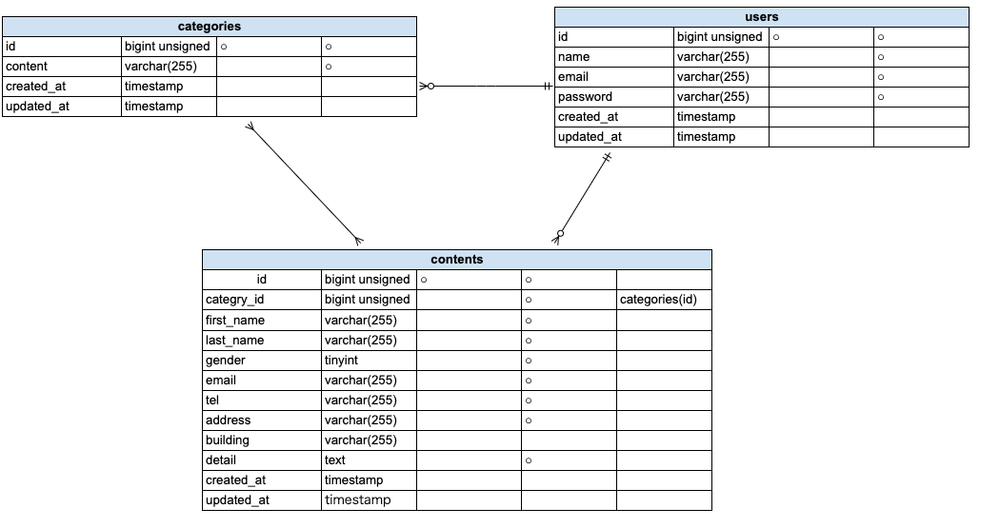

# Dockerビルド

- プロジェクトをクローンする

```
git clone git@github.com:Maki0421makimaki/test-contact-form.git
```

- リポジトリ名を変更

```
mv laravel-docker-template リポジトリ名
```

- リポートリポジトリのURL変更

```
cd todo
git remote set-url origin 作成したリポジトリのurl
git remote -v
```

- ローカルリポジトリの内容をリモートに反映

```
git add .
git commit -m "リモートリポジトリの変更"
git push origin main
```

- ドッカーのビルドして立ち上げる

```
docker-compose up -d --build
```

## Laravel環境構築

- docker-compose exec php bash
- composer install
- cp .env.example .env ,環境変数を適宜変更
- php artisan key:generate
- php artisan migrate
- php artisan db:seed

## 開発環境

- お問い合わせ画面：http://localhost/
- ユーザー登録：http://localhost/register
- phpMyAdmin:http://localhost:8080/

## 使用技術

- PHP 8.1.34
- Laravel 8.83.8
- MySQL 8.0.26
- nginx 1.21.1

## ER図


